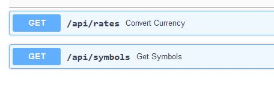
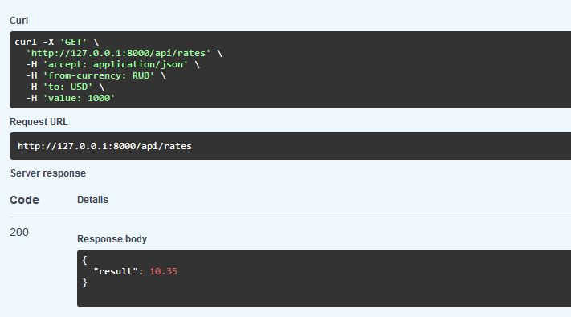
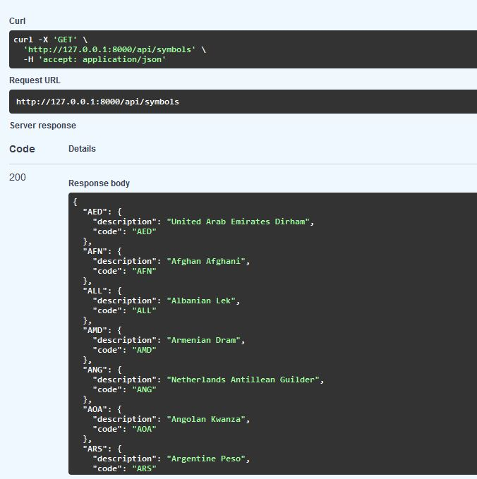

# Конвертер валют

Публичный API сервис для конвертации валют

Два эндпоинта:
- принимает две валюты конвертации и количество, возвращает конвертировнную валюту
- возвращает список доступных валют для конвертации

## Установка
### Клонируем репозиторий
    mkdir app
    cd cat app
    git clone https://github.com/se-andrey/insurance_api.git

Если на сервере нет docker/docker-compose, то установите его - инструкция https://docs.docker.com/
    
	docker-compose up --build 

Для остановки
    
	docker-compose down 

### Пример использования

#### Эндпоинты

#### Конвертация валют

#### Доступные валюты

